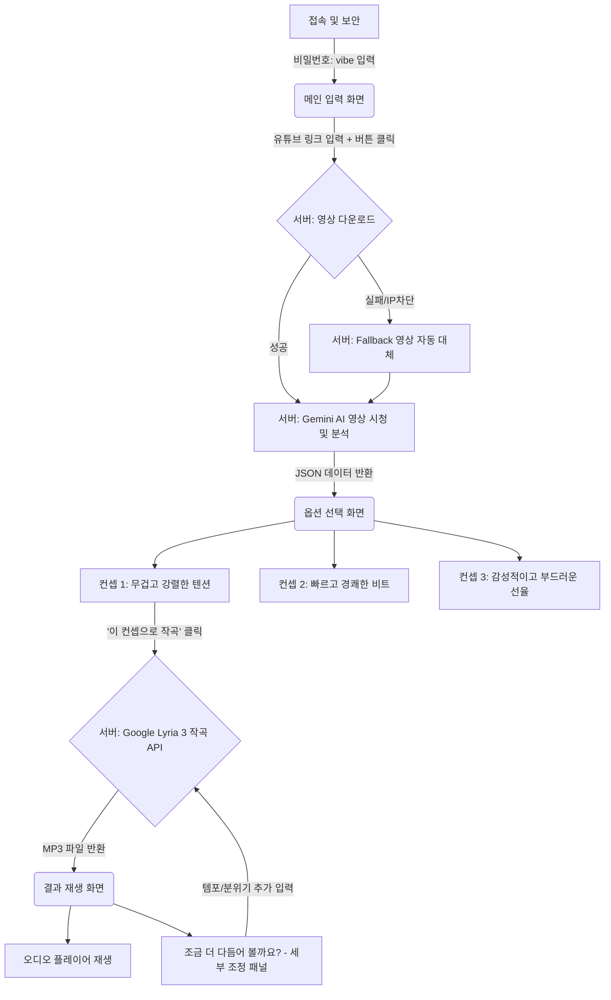

# VideoVibe - 시스템 아키텍처 및 와이어프레임 (Architecture & Wireframe)

## 📌 시스템 개요 (System Overview)
VideoVibe는 사용자가 제공한 유튜브 영상(Shorts 등)의 시각적, 청각적, 텍스트 맥락을 AI가 종합적으로 분석하여 최적의 BGM(배경음악) 컨셉을 기획하고, 이를 바탕으로 세상에 단 하나뿐인 오리지널 BGM을 즉시 생성해 주는 AI 기반 오디오 자동 작곡 서비스입니다.

---

## 🏗 시스템 아키텍처 (Architecture)

### 1. Frontend (사용자 인터페이스)
* **기술 스택:** HTML5, CSS3 (Vanilla), JavaScript (ES6)
* **주요 역할:** 
  * 사용자로부터 유튜브 링크 입력 수신
  * 로딩 애니메이션 및 분석 과정 시각화
  * 3가지 BGM 컨셉 제안 카드 렌더링
  * 오디오 플레이어 UI 및 추가 세부 조정(Tweak) 패널 제공
  * **보안:** `sessionStorage`를 활용한 간단한 JS 프롬프트 비밀번호 잠금 (`vibe`)

### 2. Backend (API & 비즈니스 로직)
* **기술 스택:** Python 3, FastAPI, Uvicorn, yt-dlp, Google GenAI SDK (Gemini 1.5 / 3.5 Flash)
* **주요 역할:**
  * **정적 파일 서빙:** `/` 경로에서 Frontend 리소스(HTML/CSS/JS) 호스팅
  * **영상 다운로드 모듈 (`yt-dlp`):** 
    * 유튜브 URL에서 MP4 영상 및 메타데이터 추출
    * (IP 차단/에러 발생 시 내장된 `ioniq6.mp4` 영상으로 자동 전환하는 Fallback 방어막 기능 탑재)
  * **영상 분석 모듈 (`/api/analyze`):**
    * 다운로드한 영상 파일을 Google Gemini API 서버로 업로드 (`upload_file`)
    * 영상 내용(시각+청각)을 바탕으로 3가지 음악 컨셉(타이틀, 설명, Lyria 프롬프트)을 구조화된 JSON 데이터로 추출
  * **음악 생성 모듈 (`/api/generate`):**
    * Google Lyria 3 API (`lyria-3-pro-preview`)를 호출하여 프롬프트 기반 실제 `.mp3` 오디오 트랙 생성
    * 생성된 바이너리 오디오를 임시 디렉토리(`temp_audio`)에 저장하고 정적 파일(`StaticFiles`)로 스트리밍 제공

### 3. 인프라 및 배포 (Infrastructure)
* **로컬 서버:** `localhost:8000` (FastAPI 앱 구동)
* **외부 터널링 (데모용):** `localtunnel` (npx)
  * 사내망/외부망 상관없이 심사위원들이 로컬 백엔드로 다이렉트 통신할 수 있도록 퍼블릭 임시 URL 제공
  * 클라우드 서버(Render 등)의 구글/유튜브 IP 차단 문제를 완벽하게 회피

---

## 📱 UI 와이어프레임 흐름도 (Wireframe Flow)



## 🛠 주요 트러블슈팅 및 극복 사례
1. **유튜브 클라우드 IP 차단 문제:** 미국 클라우드 서버(Render) 배포 시 유튜브 봇 차단 정책으로 다운로드가 막히는 현상 발생. 
   👉 **해결:** 로컬 PC에서 구동 후 `localtunnel`을 활용한 다이렉트 터널링 방식으로 우회하여 안정적인 영상 다운로드 확보. 
   👉 **이중 안전장치:** 통신 불량 시에도 데모가 멈추지 않도록 백엔드에 로컬 Fallback 영상(`ioniq6.mp4`) 자동 전환 로직 구현.
2. **AI SDK JSON 파싱 버그:** 최신 Google GenAI SDK에서 Pydantic 스키마 검증 시 사전(Dict) 객체 오류(`'dict' object has no attribute 'upper'`) 발생.
   👉 **해결:** SDK의 스키마 자동 검증 기능을 과감히 제거하고, AI에게 강력한 시스템 프롬프트(System Prompt)를 부여한 뒤 백엔드 파이썬 코드 레벨에서 마크다운 백틱(```json)을 수동으로 벗겨내고 파싱하는 안정적인 로직으로 전면 개편.
